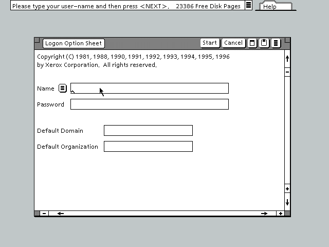

# GlobalView 2.1

From the [GUI Gallery](http://toastytech.com/guis/gv.html):

> GlobalView 2.1, released in 1996, is the descendant of the Xerox Star ViewPoint desktop software. The Xerox Star was the 1981 commercial successor to the Xerox Alto. The Xerox Star and GlobalView were primarily sold  as a document processing system although they could do much more.
> 
> GlobalView runs on an IBM-PC compatible under Microsoft Windows (3.1, 95, 98, possibly ME but not NT, 2000, or XP due to the use of .386 VXDs). For all practical purposes GlobalView is not a Windows application, it is essentially the Xerox Star desktop and OS software running in an emulator. Earlier versions of GlobalView required a hardware MESA CPU add-on board, however this version uses a software emulator.

Xerox Star (1981) | GlobalView (1996)
----------------- | -----------------
 | 

From [Wikipedia](https://en.wikipedia.org/wiki/GlobalView):

> GlobalView was an integrated “desktop environment” including word-processing, desktop-publishing, and simple calculation (spreadsheet) and database functionality, developed at Xerox Parc as a way to run the software originally developed for their Xerox Alto, Xerox Star and Xerox Daybreak 6085 specialized workstations on SUN Microsystems workstations and IBM PC-based platforms. Initially it required an additional processor on a PC expansion card, later it was run using emulation. Though the software it was based on had once been far ahead of its time (in terms of its integration and use of a graphical user interface), the high cost of the processor and later low speed of the emulator doomed it to poor sales (almost exclusively old customers of the Alto and Star, recognized as precursors of the Apple Macintosh but in themselves expensive corporate niche machines). The resulting lack of resources for development left it to fall further and further behind its competitors. It existed from the late 1980s until the early 1990s.

## Usage

- clone this repo
- `./run.sh`

*Note: the password is `pass`*

--

Source: https://winworldpc.com/product/xerox-globalview
